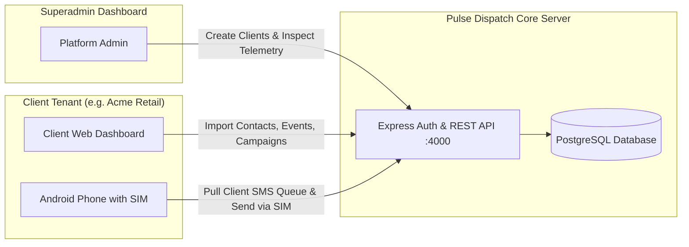

# Pulse Dispatch — Complete Platform User Manual

A comprehensive operational manual for **Platform Administrators (Superusers)** and **Business Clients (Tenants)** using the Pulse Dispatch Web Application and Companion Android SIM Gateway App.

---

## Table of Contents
1. [Platform Architecture & Concept](#1-platform-architecture--concept)
2. [Superuser (Administrator) Operations Guide](#2-superuser-administrator-operations-guide)
   - [2.1 Logging in as Superadmin](#21-logging-in-as-superadmin)
   - [2.2 Managing Client Accounts (/users)](#22-managing-client-accounts-users)
   - [2.3 Creating New Client Users](#23-creating-new-client-users)
   - [2.4 Disabling & Enabling Client Accounts](#24-disabling--enabling-client-accounts)
   - [2.5 Resetting Client Passwords](#25-resetting-client-passwords)
   - [2.6 Inspecting Client Hardware & Activity Logs](#26-inspecting-client-hardware--activity-logs)
   - [2.7 Global Oversight](#27-global-oversight)
3. [Client User Guide (End Customer / Tenant)](#3-client-user-guide-end-customer--tenant)
   - [3.1 Web Dashboard Overview](#31-web-dashboard-overview)
   - [3.2 Importing Contacts via Excel Spreadsheet](#32-importing-contacts-via-excel-spreadsheet)
   - [3.3 Managing Customer Contacts](#33-managing-customer-contacts)
   - [3.4 Scheduling Events](#34-scheduling-events)
   - [3.5 Creating Message Templates](#35-creating-message-templates)
   - [3.6 Launching SMS Campaigns](#36-launching-sms-campaigns)
   - [3.7 Real-time Broadcast Audit Logs](#37-real-time-broadcast-audit-logs)
4. [Android Companion App Setup & SIM Gateway](#4-android-companion-app-setup--sim-gateway)
   - [4.1 Installing the Production APK](#41-installing-the-production-apk)
   - [4.2 Configuring the Server URL](#42-configuring-the-server-url)
   - [4.3 Logging In with Client Credentials](#43-logging-in-with-client-credentials)
   - [4.4 Permissions & Automatic SIM Dispatch](#44-permissions--automatic-sim-dispatch)
   - [4.5 Viewing Live Activity Stream & Support Tickets](#45-viewing-live-activity-stream--support-tickets)
5. [Production Deployment & Server Publishing](#5-production-deployment--server-publishing)
6. [Troubleshooting & FAQs](#6-troubleshooting--faqs)

---

## 1. Platform Architecture & Concept

Pulse Dispatch turns standard Android smartphones into **private, low-cost SMS broadcast gateways**.



### Strict Multi-Tenant Isolation
- **Client Users (`CLIENT`)**: Only see and manage **their own** customer records, events, campaigns, templates, and registered phones.
- **Android Phone Companion**: An Android phone logged in with a client's account **strictly pulls and dispatches SMS jobs for that specific client's campaigns**.
- **Superuser (`SUPERADMIN`)**: Has global access across all clients and exclusive authority to provision client logins and control access.

---

## 2. Superuser (Administrator) Operations Guide

### 2.1 Logging in as Superadmin
1. Navigate to the Web App URL (e.g. `http://localhost:3000/login` or `https://your-domain.com/login`).
2. Sign in with the Superadmin credentials:
   - **Email:** `pulak@example.com`
   - **Password:** `admin12345`
3. Upon login, the sidebar will include the exclusive **Users & Clients** management tab.

---

### 2.2 Managing Client Accounts (`/users`)
Click **Users & Clients** in the sidebar navigation. This page displays:
- **Metrics Summary**: Total registered users, active client tenants, disabled accounts, and registered Android hardware phones.
- **Search & Filter Suite**: Search across names, emails, company names, or phone numbers, and filter by Role (`SUPERADMIN`, `ADMIN`, `CLIENT`) and Status (`ACTIVE`, `DISABLED`).
- **User Directory Table**: Displays each user's company, contact info, role badge, status pill, connected device count, and quick action buttons.

---

### 2.3 Creating New Client Users
To onboard a new customer/client who purchased the service:
1. Click the **+ Create Client User** button at the top right of `/users`.
2. Fill in the modal form:
   - **Full Name:** Client contact name (e.g. `David Miller`).
   - **Email Address (Username):** Client login email (e.g. `david@apexretail.com`).
   - **Account Password:** Set an initial password for the client (e.g. `ApexPass2026!`).
   - **Company / Business Name:** Client organization (e.g. `Apex Retail Pty Ltd`).
   - **Contact Phone & City Address:** Client phone number and location.
   - **Assigned Role:** Select `Client (Standard Tenant)`.
   - **Internal Notes:** Optional notes (e.g. `Annual plan with 10k monthly SMS`).
3. Click **Create User Account**.
4. The client can now immediately log in to both the **Web Dashboard** and **Android Phone App** using their email and password.

---

### 2.4 Disabling & Enabling Client Accounts
- If a client's subscription expires or needs to be paused:
  - Find the client row in `/users` and click the **Disable** button.
  - The client's account status turns **DISABLED (RED)**.
  - The client is **immediately blocked** with `403 Forbidden` from logging in or sending SMS on both the web and Android app.
- To reactivate the client:
  - Click **Enable** on their row. Access is instantly restored.

---

### 2.5 Resetting Client Passwords
1. Click the **Key icon (Reset Password)** on the client's row in `/users`.
2. Enter the new password and confirm.
3. Provide the updated password to your client.

---

### 2.6 Inspecting Client Hardware & Activity Logs
1. Click the **Eye icon (View Activity)** on any client row.
2. The **Client Activity & Telemetry Drawer** will open, showing:
   - Client profile and contact information.
   - **Linked Android Gateway Phones**: Hardware name (e.g. `Samsung Galaxy A55`), SIM carrier (`Telstra AU`), SIM phone number, battery percentage, and live online/offline status.
   - **Recent Activity Stream**: Live logs of SMS sends, device logins, and support tickets.

---

## 3. Client User Guide (End Customer / Tenant)

### 3.1 Web Dashboard Overview (`/dashboard`)
When a client logs in with their credentials:
- **Ready to Send**: Live count of valid contacts with SMS consent.
- **Active Campaigns**: Current progress of outgoing broadcasts.
- **Delivered Messages**: Total successful SMS dispatches and delivery rate.
- **Linked Phone**: Status of their paired Android phone gateway.

---

### 3.2 Importing Contacts via Excel Spreadsheet (`/imports`)
1. Click **Imports** in the sidebar.
2. Drag and drop your `.xlsx`, `.xls`, or `.csv` spreadsheet.
3. The platform automatically detects columns:
   - `Name` / `Full Name`
   - `Mobile` / `Phone Number`
   - `Company` / `City`
   - `Tags` / `Segments`
4. Set your default SMS message template using merge tags (e.g. `Hi [Name], your order is ready!`).
5. Click **Import & Queue Campaign**. Contacts are validated, deduplicated, and inserted into your isolated database directory.

---

### 3.3 Managing Customer Contacts (`/customers`)
1. Click **Customers** in the sidebar.
2. Use the live search bar to search by name, mobile, email, or city.
3. Filter by **SMS Consented**, **Email Consented**, or **All Contacts**.
4. Click **+ Add Customer** to insert individual client records.
5. Delete or edit customer consent at any time.

---

### 3.4 Scheduling Events (`/events`)
1. Click **Events** in the sidebar.
2. Click **+ Create Event**.
3. Set the **Event Title**, **Date & Time**, **Venue**, **Target Audience**, and the customized **SMS Broadcast Template**.
4. Click **Launch Campaign** directly from the event card to trigger the broadcast to your audience.

---

### 3.5 Creating Message Templates (`/templates`)
1. Click **Templates** in the sidebar.
2. Click **+ Create Template**.
3. Choose channel (`SMS` or `Email`), category (`Promotional`, `Reminder`, `Alert`), and message body.
4. Use variable merge tags such as `{{name}}`, `{{company}}`, `{{venue}}`.
5. Templates can be reused across all campaigns.

---

### 3.6 Launching SMS Campaigns (`/campaigns`)
1. Click **Campaigns** in the sidebar.
2. Click **+ Create Campaign**.
3. Enter Campaign Name, choose `SMS (Android SIM)` channel, select optional linked Event, and customize the message.
4. Set the audience limit and click **Launch & Queue SMS**.
5. The SMS jobs will appear in the **Live Android SIM Dispatch Queue**.
6. Your connected Android phone will automatically pull the pending jobs and send them out via SIM!

---

### 3.7 Real-time Broadcast Audit Logs (`/logs`)
1. Click **Logs** in the sidebar.
2. Filter logs by Status (`SENT`, `FAILED`, `PENDING`) and Channel (`SMS`, `EMAIL`).
3. Search for specific recipient numbers or message contents.
4. Every sent message records the carrier delivery status and exact timestamp.

---

## 4. Android Companion App Setup & SIM Gateway

The companion Android application (**Pulse Sender**) turns the client's phone into their private SMS transmission gateway.

---

### 4.1 Installing the Production APK
1. Download the production APK file:
   - **Path:** `android-app/app/build/outputs/apk/release/app-release.apk`
2. Transfer `app-release.apk` to any Android smartphone (Android 10.0+ / API 29+).
3. Tap the `.apk` file on the phone and select **Install** (allow "Install from unknown sources" if prompted).

---

### 4.2 Configuring the Server URL
1. Open the **Pulse Sender** app on the phone.
2. On the login screen, tap **🌐 API Gateway Server**.
3. Enter your web server's public API URL:
   - For production domain: `https://your-domain.com` (or `https://api.your-domain.com`)
   - For local network / testing: `http://192.168.1.50:4000`
4. The app automatically sanitizes the URL formatting.

---

### 4.3 Logging In with Client Credentials
1. Enter the client's **Email** and **Password** created by the Superadmin.
2. Tap **Sign In**.
3. The app authenticates, loads the client's profile, and displays their **`CLIENT`** badge and company name in the side drawer.

---

### 4.4 Permissions & Automatic SIM Dispatch
1. When prompted on first login, tap **Allow** for:
   - **Send SMS Messages**: Required to dispatch text messages through your carrier SIM.
   - **Notifications**: Keeps the background dispatch service running reliably.
2. The phone registers its hardware name, SIM operator, and SIM phone number with the server.
3. When SMS jobs are queued from the web app, the phone automatically fetches them and sends them one by one.
4. You can also manually tap **Process Queue** or view jobs in **Pulse Sender (Jobs)**.

---

### 4.5 Viewing Live Activity Stream & Support Tickets
- **Activity Log**: Tap the drawer $\rightarrow$ **Activity Log** to view real-time SMS delivery confirmations, carrier results, and filter by Today / Yesterday / Last 7 Days.
- **Support Tickets**: Tap the drawer $\rightarrow$ **Ticket Support** $\rightarrow$ **+ New Ticket** to submit support inquiries directly to the platform administrators.

---

## 5. Production Deployment & Server Publishing

### Backend & Database (Docker Deployment)
1. On your VPS or cloud server (Ubuntu/Debian, Docker & Docker Compose installed):
   ```bash
   git clone https://github.com/pulok529/SMSSendingAPP.git
   cd SMSSendingAPP
   docker compose up -d --build
   ```
2. The Express API will run on port `4000`, PostgreSQL on port `5432`, and Redis on port `6379`.
3. Set up a reverse proxy (e.g. Nginx, Caddy, or Cloudflare) with SSL (`https://api.yourdomain.com` $\rightarrow$ `http://localhost:4000`).

### Web Application (Next.js)
1. Build and start the Next.js production server:
   ```bash
   npm ci
   npm run build
   npm run start
   ```
2. Reverse proxy port `3000` with SSL (`https://yourdomain.com` $\rightarrow$ `http://localhost:3000`).

---

## 6. Troubleshooting & FAQs

| Issue | Cause | Solution |
| :--- | :--- | :--- |
| **"Cannot reach server" on Mobile App** | Incorrect Server URL or phone has no internet | Tap "API Gateway Server" on login screen and verify URL (e.g. `https://api.yourdomain.com`). Ensure phone has Wi-Fi or mobile data. |
| **"Your account has been disabled"** | Superadmin deactivated the account | Contact platform administrator to re-enable your client account in `/users`. |
| **SMS jobs stay in "PENDING" status** | Phone is offline or background service is paused | Open Pulse Sender app on phone, check SIM reception, and ensure "Auto-Fetch Queue" is enabled in Settings. |
| **Android kills background dispatch** | Battery optimization settings on phone | Go to Android Settings $\rightarrow$ Apps $\rightarrow$ Pulse Sender $\rightarrow$ Battery $\rightarrow$ Select **Unrestricted**. |
| **Carrier limits bulk sending** | Mobile carrier spam throttling | Send in batches of 50–200 with normal delays configured in Settings. |

---

*Pulse Dispatch — Enterprise SMS Broadcast & Multi-Tenant Management Platform*
